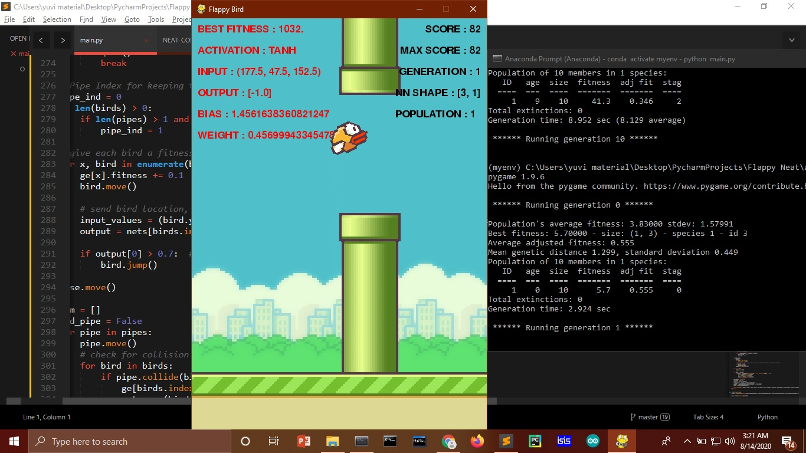

# AI Flappy Bird with NeuroEvolution of Augmenting Topologies <strong>(NEAT)</strong>
NeuroEvolution of Augmenting Topologies is a method for evolving artificial neural networks with a **Genetic Algorithm**. NEAT implements the idea that it is most effective to start evolution with small, simple neural networks and allow them to become increasingly complex over generations.
 
NEAT and Genetic Algorithm has the ability to add or remove a neural node hence making the network complex over time and improving the result

# My NEAT Configuration
<a href="NEAT-CONFIG.txt">HERE</a>

